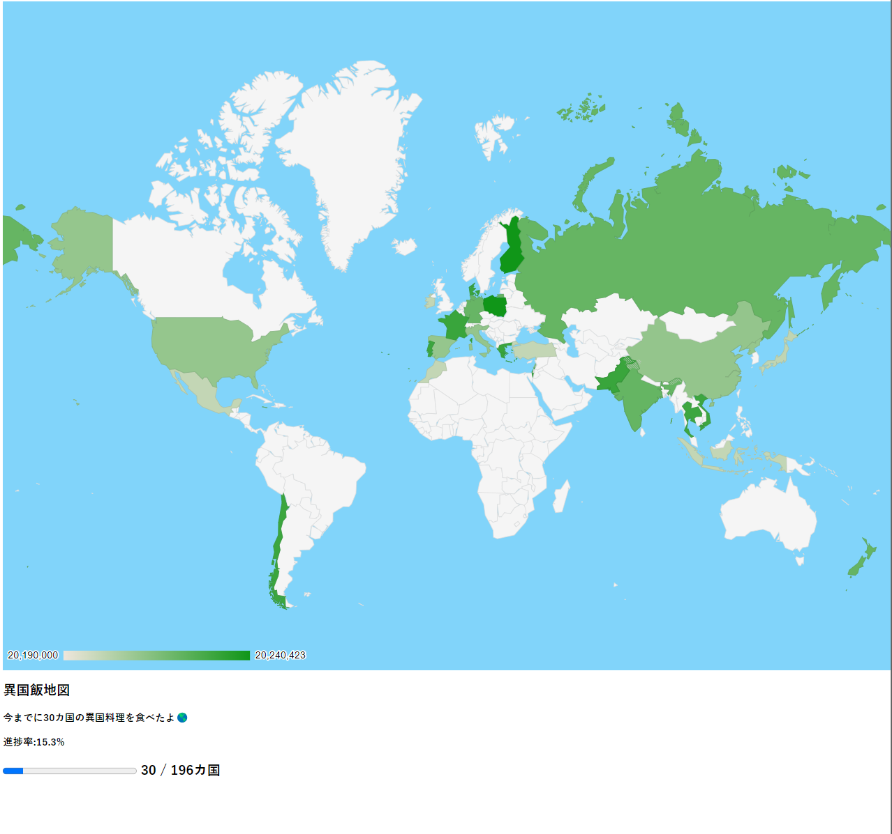

# Development

Run the following command in the root of the project to start the Dioxus dev server:

```bash
dx serve --hot-reload
```

- Open the browser to http://localhost:8080

# 概要

自分がこれまでに食べた海外料理の国を世界地図で塗りつぶし

[GeoChart](https://developers.google.com/chart/interactive/docs/gallery/geochart?hl=ja)を使ってます

